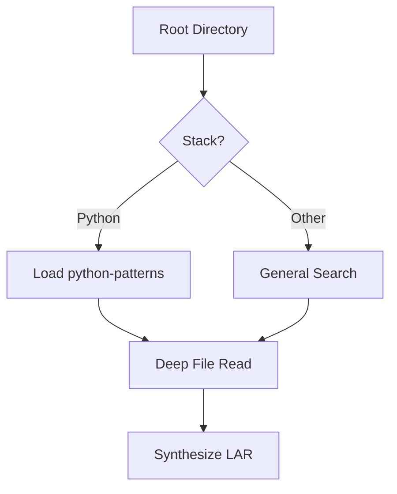

# Literate Programming Workflows

This document details the procedural steps for executing "Literate" tasks.

## The Weaving Process (Documentation Generation)

1. **The Lead**: Start with a high-level "Executive Summary" that describes the system's "Vibe" or intent.
2. **The Backbone**: Identify the core data structures (The "Characters").
3. **The Plot**: Trace how data flows through the system.
4. **The Climax**: Highlight the most critical piece of logic (The "Solution").
5. **The Epilogue**: Describe how to extend or maintain the system.

## The Tangling Process (Code Extraction)

When extracting code from the codebase to include in your report:
- **Pruning**: Remove boilerplate (imports, simple getters/setters) unless they are critical to the architecture.
- **Highlighting**: Use comments within code blocks to point out specific architectural decisions.
- **Mapping**: Explicitly state which file and line range a snippet comes from.

## Progressive Search Pattern

